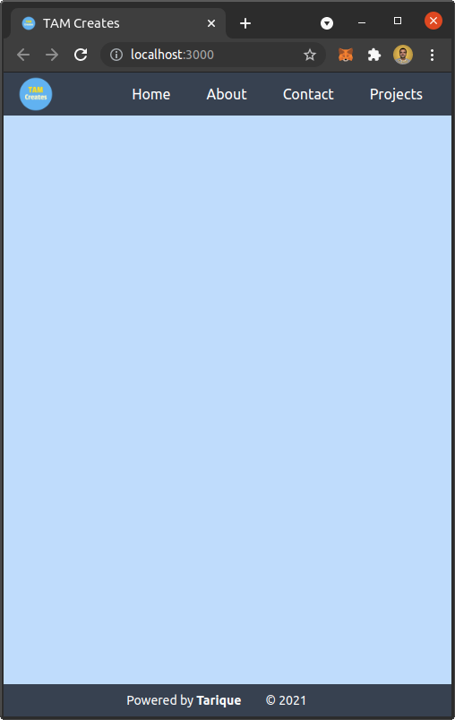
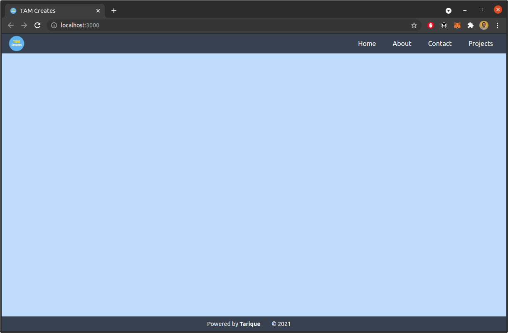
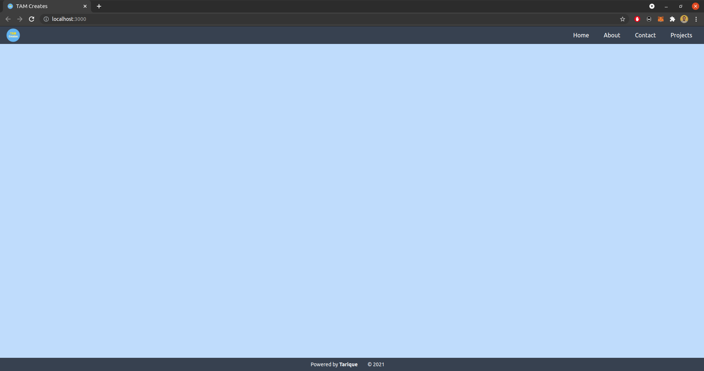

This is a template repository that has a responsive Navigation, Footer, and a canvas element filling everything in between.

## Built with

The following technologies are used in this template.

- [ReactJS](https://reactjs.org/) - For UI
- [NextJS](https://nextjs.com/) - For server side rendering of the React UI
- [TypeScript](https://www.typescriptlang.org/) - For static types
- [TailwindCSS](https://tailwindcss.com/) - For CSS
- [PostCSS](https://postcss.org/) - To minify CSS file for production

## Screenshots

## Creator

- [Tarique](https://github.com/tarique1988)
